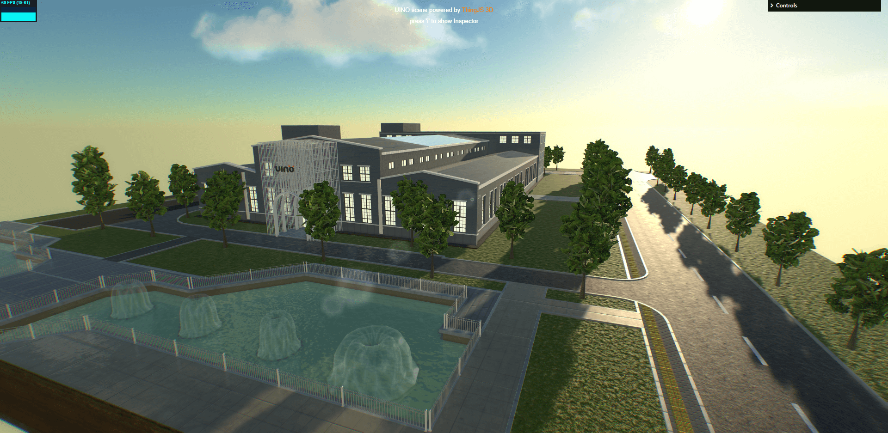
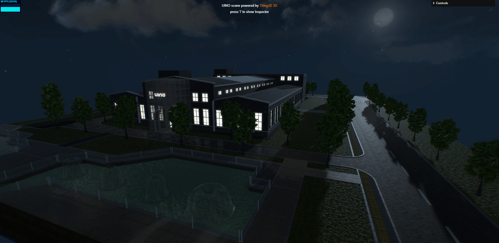

# t3d-scene-demo

使用[t3d.js](https://github.com/UINOSOFT/t3d.js)开发的场景渲染示例。

[在线预览](https://shawn0326.github.io/t3d-scene-demo/)




## 开发测试

````
npm run dev
````

## 部署

````
npm run build
````

将`dist`文件夹部署在服务器即可。

## 开发建议

建议使用VSCode进行开发，并安装`Prettier`插件（一个比较严格的代码风格统一工具，因为本项目自带`.vscode`配置，因此无需再做额外配置）。